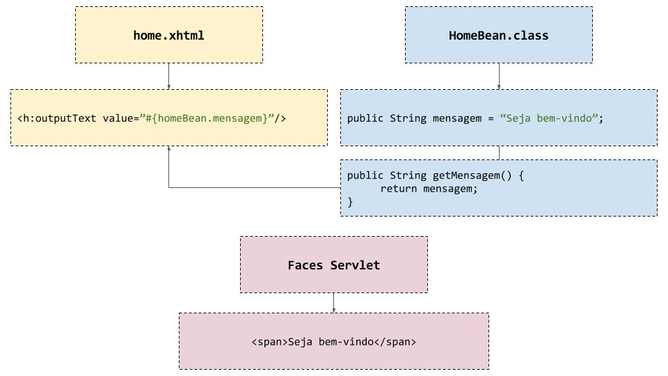

<h1>
JavaServer Faces
</h1>

O JSF, JavaServer Faces, uma especificação padrão MVC e do Java que abstrai as dificuldades em relação ao server (container web) e orientada a componentes na interface do usuário, como os botões, inputs, form, etc.

O JavaServer Faces uma especificação padrão MVC e do Java que abstrai as dificuldades em relação ao server (container web) e orientada a componentes na interface do usuário, como os botões, inputs, form, etc. Desde de <b>2004</b>.

<b>1.0v</b> versão não teve muito sucesso devido a alta concorrência, mas era e é facilmente integrável; 
    <b>2.0v</b> Adição nativa dos plugins que amadureceram para o jsf em 2009, como o Ajax, Facelets, Scopes; Suporte para as config (Bean's CDI, Navegation, Rules, Locale com as <i>Anotações</i>) e adeção ao ecossistema jee (estágio do projeto e dev components).

<h2>SERVLETS</h2>

"Pois ao final tudo é Servlet!"

Base de toda a estrutura do Java Web até os dias de hoje, "convertendo" os arquivos em algumm framework para html puro.
Responsável por desenvolver a Infraestrutura do projeto, mesmo sem vê-lo. Anteriormente, era constituido em presença direta, mas pelo alto nível de dificuldade foi simplificado pelas aplicações web.

Ex.: out.println("<table class=\"table\">"); 

<i>XHTML e através de Data Binding conectá-las a classes Java.</i>

Sendo Classes do java que rodam no Server atendendo requests e responses (browser).

<h2>MVC</h2>

Model - View - Controler
  

<i>Model</i> - Entidades, classe de integração com os atributos no banco de dados;

<i>View</i> - Interface, camada de visualização do usuário;

<i>Controller</i> - Managed, classe de controle entre as requests e responses.

 

<b>Porject Struture</b>
* ( dinamic web project (configuration modify) + jdk + mojarra <.jar> )
* ( maven project )
- java
- statics
- WEB-INF
- webapp
  * pom

<h2>JSF</h2>

Especificação do MVC do <u>JCP</u> - <b>Acoplamento</b>. Vigente oficialmente como tecnologia de front padrão do <u>JEE</u>. 
Programação OO para Eventos facilitando os componentes e abstraindo as conexões.
 

Para funcionar será necessário contemplar as suas implementações principais e estruturais:

<b>A implementação do Servelt e do Faces.</b>

JDK + IDE + <u>(web-container) Server</u>.   - Podem serem instaladas as implementações se não for utilizar o <u>Maven</u>.

<dependency>
	<groupId>com.sun.faces</groupId>
	<artifactId>jsf-impl</artifactId>
	<version>2.2.20</version>
</dependency>

 

<dependency>
	<groupId>com.sun.faces</groupId>
	<artifactId>jsf-api</artifactId>
	<version>2.2.20</version>
</dependency>

<h2>PRIMEFACES</h2>

Faz parte das <b>bibliotecas que enriquecem os componentes</b> do jsf para abstrair as dificuldades da visão. 

<h2>REFERÊNCIAS</h2>
Guia de <a href="https://www.devmedia.com.br/guia/jsf-javaserver-faces/38322">BASE DEVELOP.</a>    
<a href="https://www.devmedia.com.br/guia/jsf-javaserver-faces/38322">GUIA DE JSF</a>  
<a href="https://www.devmedia.com.br/cursos/java">CURSO DE JAVA</a>  
<a href="https://www.devmedia.com.br/guias/java">GUIAS DE ESTUDOS JAVA</a>  
<a href="https://www.devmedia.com.br/guia/java-enterprise-edition-java-ee/34474">Java EE</a>

 

<pre>
Realizador:
° RYAN CASTRO FERREIRA.
<b style="color: blue;">LinkdIn </b>- <a href="https://www.linkedin.com/in/ryan-castro-ferreira">https://www.linkedin.com/in/ryan-castro-ferreira/</a>
<b style="color: red;">Email </b>- ryancasf@gmail.com
</pre>
